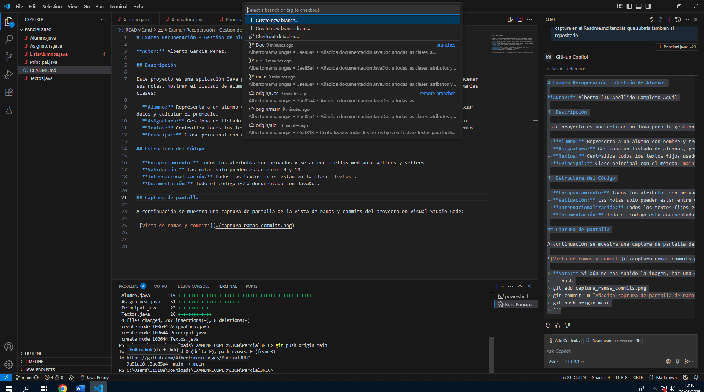

# Examen Recuperación - Gestión de Alumnos

**Autor:** Alberto Garcia Perez.

## Descripción

Este proyecto es una aplicación Java para la gestión de alumnos en una asignatura. Permite dar de alta alumnos, almacenar sus notas, mostrar el listado de alumnos y calcular la nota media de la asignatura. El código está estructurado en varias clases:

- **Alumno:** Representa a un alumno con nombre y tres notas, con validación de rangos y métodos para obtener/modificar datos y calcular el promedio.
- **Asignatura:** Gestiona un listado de alumnos, permite añadir alumnos, mostrar el listado y calcular la nota media.
- **Textos:** Centraliza todos los textos fijos usados en la aplicación para facilitar la traducción y el mantenimiento.
- **Principal:** Clase principal con el método `main` que ejecuta la aplicación.

## Estructura del Código

- **Encapsulamiento:** Todos los atributos son privados y se accede a ellos mediante getters y setters.
- **Validación:** Las notas solo pueden estar entre 0 y 10.
- **Internacionalización:** Todos los textos fijos están en la clase `Textos`.
- **Documentación:** Todo el código está documentado con JavaDoc.

## Captura de pantalla

A continuación se muestra una captura de pantalla de la vista de ramas y commits del proyecto en Visual Studio Code:

